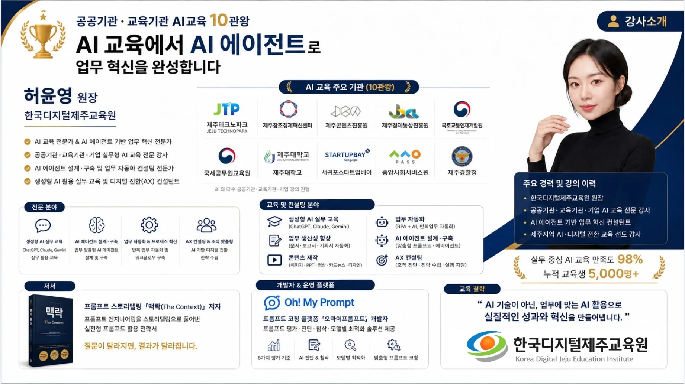

# 강사 소개

## 허윤영 원장 · 한국디지털제주교육원 (Korea Digital Jeju Education Institute)

> "AI 기술이 아닌, 업무에 맞는 AI 활용으로 실질적인 성과와 혁신을 만들어냅니다."

- 공공기관·교육기관 AI 교육 10관왕 — AI 교육에서 AI 에이전트로 업무 혁신을 완성합니다
- AI 교육 전문가 & AI 에이전트 기반 업무 혁신 전문가
- 공공기관·교육기관·기업 실무형 AI 교육 전문 강사
- AI 에이전트 설계·구축 및 업무 자동화 컨설팅 전문가
- 생성형 AI 활용 실무 교육 및 디지털 전환(AX) 컨설턴트

### AI 교육 주요 기관 (10관왕)
제주테크노파크 · 제주창조경제혁신센터 · 제주콘텐츠진흥원 · 제주경제통상진흥원 · 국토교통인재개발원 · 국세공무원교육원 · 제주대학교 · 서귀포스타트업베이 · 중앙사회서비스원 · 제주경찰청

### 전문 분야
생성형 AI 실무 교육 / AI 에이전트 설계·구축 / 업무 자동화 & 프로세스 혁신 / AX 컨설팅 & 조직 맞춤형

### 주요 경력
- 한국디지털제주교육원 원장
- 공공기관·교육기관·기업 AI 교육 전문 강사
- AI 에이전트 기반 업무 혁신 컨설턴트
- 제주지역 AI·디지털 전환 교육 선도 강사

### 저서 · 플랫폼
- 프롬프트 스토리텔링 『맥락(The Context)』 — "질문이 달라지면, 결과가 달라집니다."
- Oh! My Prompt (오마이프롬프트) — 프롬프트 평가·진단·첨삭·모델별 최적화

### 성과
실무 중심 AI 교육 만족도 98% · 누적 교육생 5,000명+

---

## 연락처
- 한국디지털제주교육원 · 허윤영 원장
- 이메일: ai_jessica@naver.com
- 홈페이지: www.koreadigitaljeju.com

이 저장소(Skill Starter 5종·에이전트·시험 샘플)에 대한 문의와 1:1 컨설팅 요청은 위 이메일로 보내 주세요.
